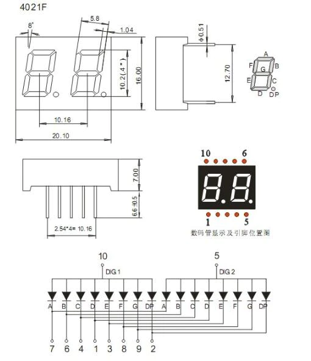

# Basic Motor control with Rotary Encoder (old circuit)

An experimental circuit where I learn how to use a motor and control it via some rotary encoder.

This project was harder than I wish to admit. The rotary encoder on this older version is somewhat buggy, refer to the newer branch, since I fixed the bug there (had to rewrite the functionality to fix it).

The code can be simplified by using a decoder such as the `SN74LS47N`, however, that would defeat the purpose of this assignment (yes, this is a college assignment).

For those wondering this is part of the course Microprocessors (INEL4206) from the University of Puerto Rico. The idea is that students did a simple program in C/C++ where we had some familiarity with either an Arduino or an ESP32 microcontroller.

My assignment is a bit different from the rest, the motor was me playing around with hardware. My classmates used a 4-digit seven-segment display. I unfortunately didn't have one in hand, and didn't wanted to over-complicate myself by connecting two separate 2-digit seven-segment displays in parallel and deal with current drops and whatnot. Adding the decoder should free 3 pins on the microcontroller, you can use a single one and switch between the common display pins (DIG1 and DIG2) to switch between the digits. Below is the datasheet of the display, is important to check if the display pins are on the anode or the cathode, as you will need to change the code a bit for the circuit to work

The breadboard circuit can be seen here, go to `datasheets` to obtain the fritzing file.

## NOTES

In this older version I attempted to utilize the decoder, as I had one. Unfortunately, my decoder turned out to be faulty and had no option but to do the decode directly from the Arduino.

Because of the time I did this I didn't knew I could "ground" the arduino pinouts by setting the pin to `LOW`, I used NPN transistors whose base is connected to the arduino pinout and the display pin to the colector. Because of how I had this circuit arranged, not only it became a spagetti of jumper cables, but the display had an interesting issue where the digit pins where somewhat dim and had a visible delay when changing. So, please, for the love of Cinnamon Crunch, refer to the newer branch